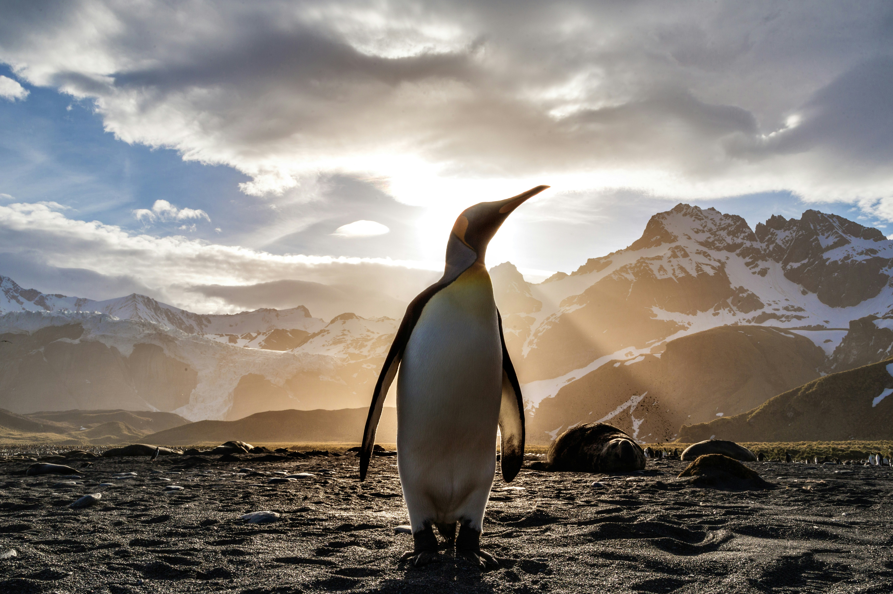

# Antarctic Penguin Species Cluster Analysis 

   
  
  [Photo Credit: Ian Parker from Unsplash](URL "https://unsplash.com/photos/standing-penguin-on-sand-near-snow-covered-mountain-covering-the-sun-from-view-at-daytime-TLcLDigmTKE")

#### Data Source: 
&nbsp; DataCamp 
#### Tag: 
&nbsp; Unsupervised Machine Learning, Cluster Analysis 
### Background 
A mini-project applying unsupervised learning techniques to identify optimum clusters and grouping penguin based on the measurement of their physical characteristics.  

#### [Notebook Link](https://github.com/mei-pan/Antarctic-Penguin-Species-Cluster-Analysis/blob/c5e61c2c32d436c3c9c586bd0259d832ffbbdc8f/Clutering_antarctic_penguin_species.ipynb)
